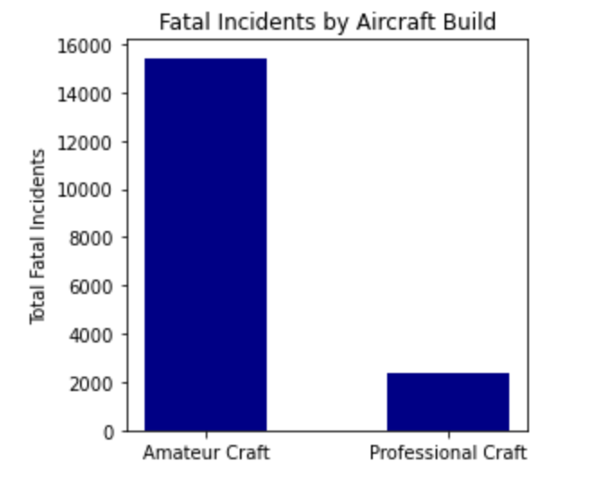
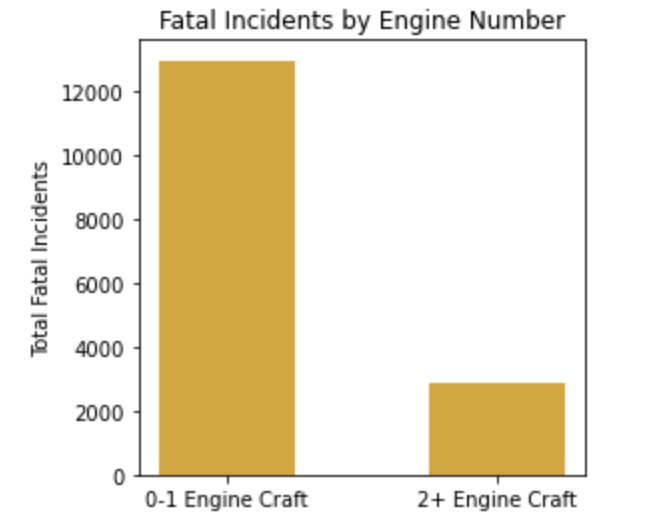
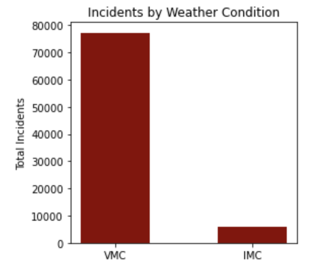

### Overview

In order to better know how to minimize the number of incidents, particularly fatal ones, when flying aircraft, we will be looking into past analytics from the National Transportation Safety Board. This comprises civil aviation accident records from 1962-2023, and has a total number of 90,348 records. Then we will discuss some recommendations for how to extrapolate past data into preventing present and future incidents.

Although we cannot necessarily answer every question regarding how incidents occur, we can consider some elements of the dataset to consider what might be leading to incidents to then rectify them.

### Dataset

```
df = pd.read_csv('data/Aviation_Data.csv', dtype = {'Event.Id' : str}, low_memory = False)
```

The dataset columns:
- event ID
- investigation type
- accident number
- event date
- location
- country
- latitude
- longitude
- airport code
- airport name
- injury severity
- aircraft damage
- aircraft category
- registration number
- make
- model
- amateur-built
- number of engines
- engine type
- FAR description
- schedule
- purpose of flight
- air carrier
- total fatal injuries
- total serious injuries
- total minor injuries
- total uninjured
- weather condition
- broad phase of flight
- report status
- publication date


### Data Analysis

Let's start by cleaning up the list of fatal crashes to group injury severity column into fatal, non-fatal, and misc. injuries.

```
fatal_rows = ['Fatal']

unique_values = set(list(df['Injury.Severity']))

for value in unique_values:
    if type(value) == str:
        if value != 'Non-Fatal' and 'Fatal' in value:
            fatal_rows.append(value)

df['Injury.Severity'] = df['Injury.Severity'].apply(lambda value: "Fatal" if value in fatal_rows else value)
```

Then, let's separate the amateur and professional craft into two dataframes, and sum the number of rows under each descriptor.

```
df_amateur = df[df['Amateur.Built'] == 'No']

df_prof = df[df['Amateur.Built'] == 'Yes']
```

```
total_amateur = df_amateur['Event.Id'].count()

total_prof = df_prof['Event.Id'].count()
```

Then plot the total fatal accidents by amateur aircraft versus professional aircraft.

```
fig, ax = plt.subplots()

fig.set_figwidth(4)

ax.bar("Amateur Craft", total_amateur_fatal, color = 'darkblue', width = 0.5)

ax.bar("Professional Craft", total_prof_fatal, color = 'darkblue', width = 0.5)

ax.set_title("Fatal Incidents by Aircraft Build")
ax.set_ylabel("Total Fatal Incidents")

plt.show()
```



There appears to be more fatal incidents involving amateur aircraft than professional aircraft, likely due to the lack of vigilant oversight that goes into professional flights, such as rigorous pilot training and extensive flight and ground crews.

In order to have safer, less fatal flights, a strong recommendation would be to utilize professional crafts and all the additional benefits that come with these, such as ground crews and dual-pilot crews.


To examine a different aspect of the robust dataset, let's group zero- and one-engine planes together (as these reflect "small" planes, often called gliders or prop planes) and group planes with two or more engines together (as these reflect "large" planes). We can sum the numbers of each group.

```

df['Number.of.Engines'] = df['Number.of.Engines'].apply(lambda value: "Small" if (value == 0.0 or value == 1.0) else value)

df['Number.of.Engines'] = df['Number.of.Engines'].apply(lambda value: "Large" if (value == 2.0 or value == 3.0 or value == 4.0 or value == 6.0 or value == 8.0) else value)
```

```
df_small = df[df['Number.of.Engines'] == 'Small']

df_large = df[df['Number.of.Engines'] == 'Large']
```

Then examine these groups in terms of how many of the incidents under each were fatal.

```
total_small_fatal = df_small[df_small['Injury.Severity'] == 'Fatal']['Event.Id'].count()

total_large_fatal = df_large[df_large['Injury.Severity'] == 'Fatal']['Event.Id'].count()
```

Finally, plot the total fatal accidents by zero- or single-engine aircraft compared to multi-engine aircraft.

```
fig, ax = plt.subplots()

fig.set_figwidth(4)

ax.bar("0-1 Engine Craft", total_small_fatal, color = 'goldenrod', width = 0.5)

ax.bar("2+ Engine Craft", total_large_fatal, color = 'goldenrod', width = 0.5)

ax.set_title("Fatal Incidents by Engine Number")
ax.set_ylabel("Total Fatal Incidents")

plt.show()
```



A somewhat similar conclusion can be gleaned from this data as from the previous set. The fewer engines an aircraft has, the more likely that plane is to be involved in a crash. This could be explained by multi-engine craft having more trained flight crew and pilots, as well as to the inherent "redundancies" built into multiple engines (if one engine is lost, additional engines can temporarily keep the plane afloat if need be).

A recommendation from this data would be to once again utilize larger aircraft for flight in order to reduce the number of fatal incidents, as well as to prioritize multi-engine craft over glider and prop planes.


To ascertain a third conclusion, let's examine the number of incidents based on the weather conditions behind flights. These conditions are listed in the dataset as VMC (Visual Meterological Conditions), which are conditions in which it is deemed safe to fly by sight alone, and IMC (Instrument Meterological Conditions), which are conditions in which instruments should be used to assist in flight (visibility is reduced).

We can start our analysis by cleaning up the unknown, and to then be unused, conditions.

```
df['Weather.Condition'] = df['Weather.Condition'].apply(lambda value : 'UNK' if value == 'UNK' or value == 'Unk' else value)
```

Then tally up the records reflecting each weather condition.

```
total_vmc = df['Weather.Condition'].value_counts()['VMC']

total_imc = df['Weather.Condition'].value_counts()['IMC']

total_unk = df['Weather.Condition'].value_counts()['UNK']
```

To conclude, plot the total accidents by VMC or IMC conditions.

```
fig, ax = plt.subplots()

fig.set_figwidth(4)

ax.bar("VMC", total_vmc, color = 'darkred', width = 0.5)

ax.bar("IMC", total_imc, color = 'darkred', width = 0.5)

ax.set_title("Incidents by Weather Condition")
ax.set_ylabel("Total Incidents")

plt.show()
```



From this information, it becomes immediately apparent that visual meteorological conditions account for more crashes than instrument meteorological conditions conditions (and unknown conditions make up a miniscule percentage of the data). Although this might not make immediate sense, as visual meteorological conditions conditions would be preferable, it could be ascertained that such conditions cause a "false sense of security" or perhaps even a lack of reliance on tools to assist in flying.

Therefore, a recommendation to better flying conditions would be to fly in instrument meteorological conditions conditions more often than in visual meteorological conditions conditions, or otherwise to utilize instruments when flying, as these can be a safety measure.


### Final Conclusions

In conclusion, to reduce the number of incidents, and the probability that those incidents are fatal, it is recommended to utilize large, professional aircraft and to take full advantage of the robust instrumentation that comes with such craft, as well as ground crew and flight crew. Additionally, as would be expected of larger craft, choose planes with more engines, as this adds redudancy and strength.